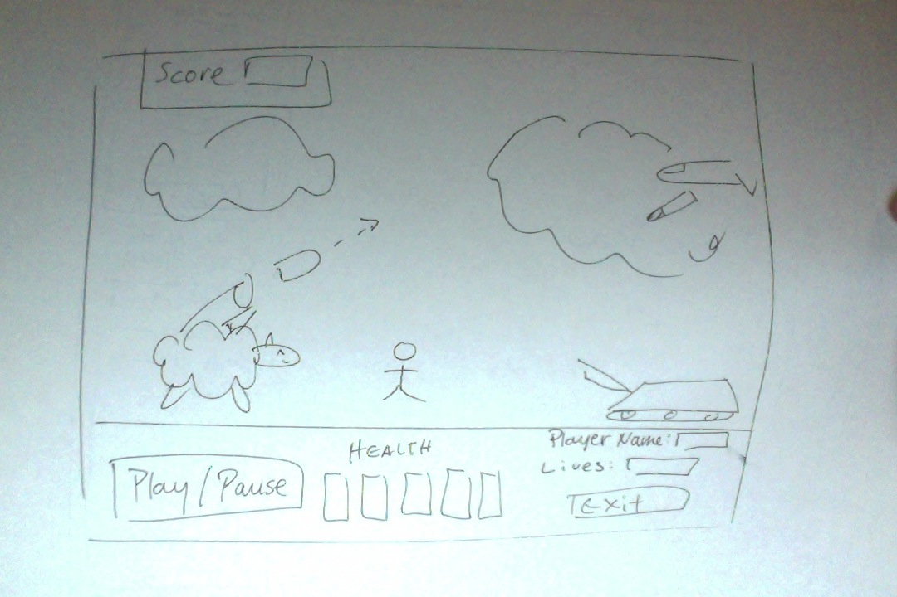
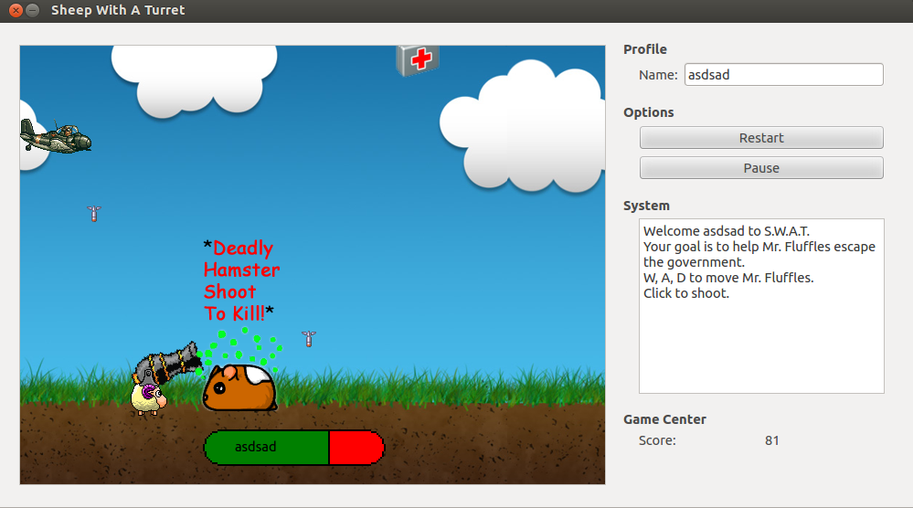

# Game Design Document : Sheep With A Turret

S.W.A.T (Sheep With a Turret) is a side scrolling shooter game. The government has been secretly experimenting with sheep turrets.
Mr. Fluffles has escaped from a secret military facility out in the Hidden Omarian Valley. Your goal is to help Mr. Fluffles escape to
freedom!

#Controls:
+ W - Jump
+ A - Move Left
+ D - Move Right
+ Mouse Cursor - Rotate Turret.
+ Mouse Click - Shoot Missiles.

#Gameplay:
+ 3 Health Maximum.
+ +1 Health if Player shoot or touch a health box.
+ -1 Health if Player hit hamster.
+ -1 Health if Player hit bullet.

+ Move left and right on the screen to dodge bullets.
+ Use your mouse cursor to aim your turret.
+ Click mouse to fire turret.
+ Airplanes take 3 hits to kill.
+ Hamsters take 1 hit to kill.
+ Health boxes take 1 hit to absorb.

#Scoring:
+ +25 pts. Shoot down airplanes (3 shots to kill).
+ +10 pts. Shoot a hamster (1 shot to kill).
+ -5 pts. per shot.
+ 1 pt. Every second.

## Objects:
### Player
+ Mr. Fluffles: Controlled by player.
 +  W - Jump
 +  A - Left
 +  D - Right
 +  Mouse - Click to fire.
+ Health Bar
 + Shows the health of Mr. Fluffles.
 + Increases or decreases based on Mr. Fluffle's health.
 + If health = 0 then Mr. Fluffles "dies"
+ Mr. Fluffle's turret
 + Stationary turret on the back of Mr. Fluffles.
 + Weapons will shoot out of the turret's nozzle.
 + Weapon rotates to face mouse cursor.
+ Mr. Fluffle's missiles
 + A missile that fires from Mr. Fluffle's turret nozzle to the mouse point.
 + When a missile collides with an enemy, the missile will damage the enemy.

### Enemies
+ Missiles
 + Enemy aircrafts shoot missiles that fire on a random location on the ground.
 + Missiles will damage Mr. Fluffles and make him lose one bar of health.
 
+ Enemy Aircraft
 + Has 3 Health Points.
 + Shoots missiles at random locations on the ground.
 + As time goes on, aircrafts gain more missiles.
 + Aircrafts take damage from Mr. Fluffle's missiles.
 + Destroyed if hit 3 times by Mr. Fluffle's missiles.
 + Always spawns above the ground.
 + Not Damaged if sheep somehow manages to touch aircraft.

+ Deadly Hamsters
 + Has 1 hit point.
 + Only spawns on the right side of the screen on the ground.
 + Does not fire anything.
 + If hit sheep, sheep will lose one health bar.
 + If hit sheep, Deadly Hamster will disappear.
 + If Mr. Fluffle's missile hits Deadly Hamster, missile is destroyed.

#Concept Art / ScreenShot

