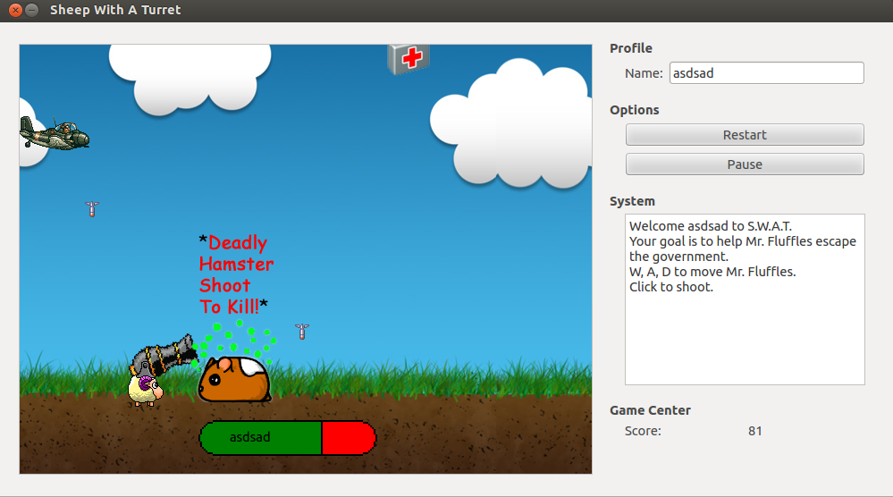

# Game - Programming Assignments
### Student Information
  + Name: Brian Chen
  + USC Email: brianych@usc.edu
  + USC ID: 8964066866

### Game Information
  + Game Name: Sheep With A Turret
  + Game Description: Help Mr. Fluffles shoot down government agents with his giant cannon.
  + [Game Design Doc](GameDesignDoc.md)
  + [Licensing](LICENSE.txt)


### Compile & Run Instructions
The grader should use the following procedure to compile and run the code:
```shell
#Compile Instructions
echo "qmake -project"
#Doxygen Instructions
echo "qmake"
#Command to run
echo "make"
#Command to run
echo "./game_brianych

###Doxygen Instructions
echo "doxygen -g config.txt"
echo "doxygen config.txt"
```

### Screenshots -- [Optional]


